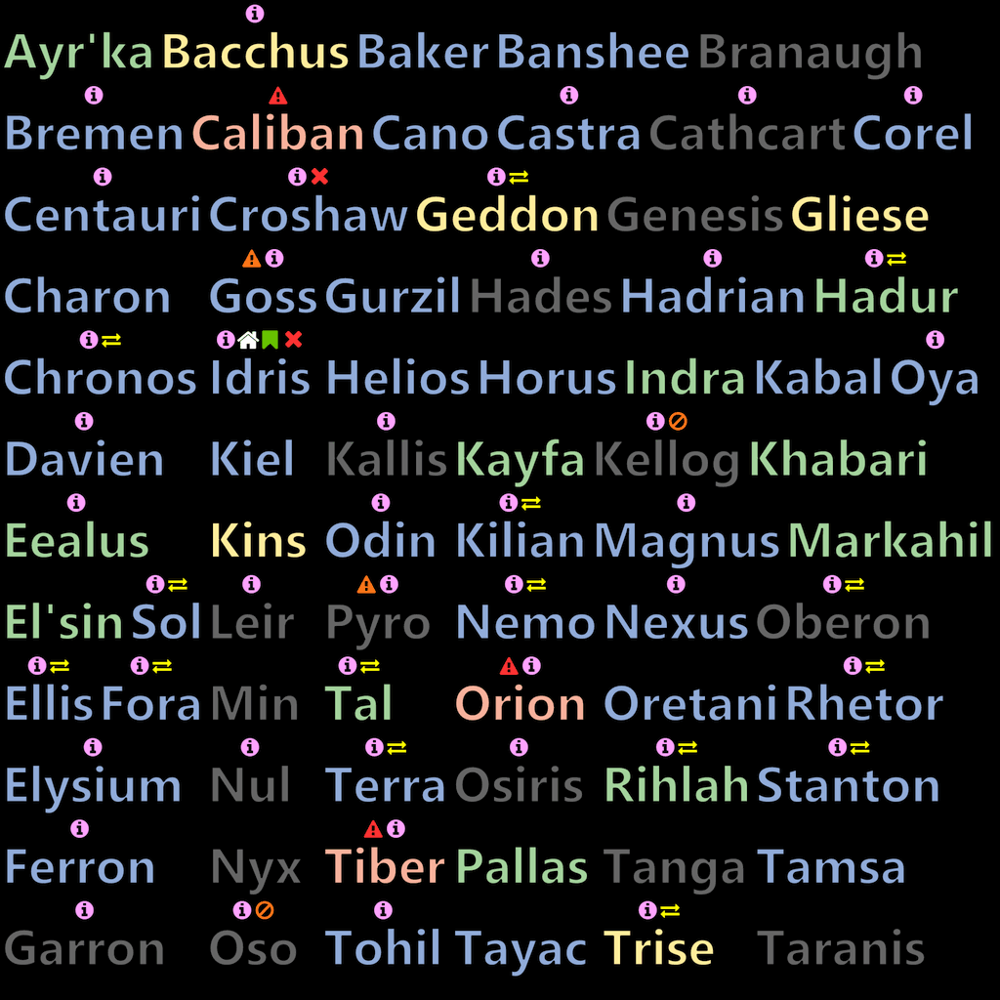

### three-sprite-texture-atlas-manager ###

[](https://codeclimate.com/github/Leeft/three-sprite-texture-atlas-manager)
[](https://codeclimate.com/github/Leeft/three-sprite-texture-atlas-manager/coverage)
[](https://david-dm.org/Leeft/three-sprite-texture-atlas-manager)
[](https://david-dm.org/Leeft/three-sprite-texture-atlas-manager#info=devDependencies)

A "sprite texture atlas" manager for [three.js](http://threejs.org/) (technically r73 and up, but you should use v125 and up: [CVE-2020-28496](https://github.com/advisories/GHSA-fq6p-x6j3-cmmq)). This module helps you to dynamically manage sprites that are shared across as many canvases as needed, and you and assign each of these fragments of the texture to an individual sprite in your scene. You draw in the canvas yourself, e.g. you can render words there with all the canvas context functions, this module reduces the VRAM usage and makes sprite assignment trivial.




Splitting up a canvas in a texture atlas helps to maximise the use of GPU memory as more recent three.js versions are able to be tricked into sharing the texture on the GPU across sprites by making sure all their `.uuid` properties are identical; this library takes care of that as well.

This library can be used either synchronously or asynchronously. If you use the async behaviour it makes use of [Promises](https://developer.mozilla.org/en/docs/Web/JavaScript/Reference/Global_Objects/Promise), and to support IE11 with the async interfaces in your WebGL application you'll also need a provide a Promise polyfill. But really, IE11?

### Run-time requirements ###

* three.js r126 or newer: http://threejs.org/
* For asynchronous node creation and IE11 support a Promise/A+ polyfill such as https://github.com/taylorhakes/promise-polyfill or https://github.com/jakearchibald/es6-promise is required.

### Examples ###

WebGL with sprites example: https://jsfiddle.net/Shiari/jzwg8ngn/.

Canvas-only example much like the usage example below: https://jsfiddle.net/Shiari/sbda72k9/.

Missing from these example is how you can more dynamically free and reallocate nodes, which you would need to do if you're changing the text in them dynamically. But if all you need are text labels then have a look at the `src/label.js` and `src/icon-label.js` classes; they make it trivial. You'll need to import these as ES2015+ modules as they are not part of the main distribution builds, and there is no documentation for them just yet. There are test scripts for them though.

### Usage ###

This is an asynchronous example, and thus it makes use of Promises. The jsfiddle examples use the slightly simpler synchronous approach which does not need Promises.

The library can be imported as a ES2016+ module, or loaded directly in the browser through its UMD build. See the jsfiddle examples for the UMD approach.

```javascript

// We want textures of 1024x1024 pixels (always a power of two)
// (this assumes "globals" mode ... for ES6 or node, import or require())
var textureManager = new window.threeSpriteAtlasTextureManager(1024);

// Make the sprite allocation code render some blue, purple and green
// borders in the nodes (this helps visualisation of what's going on)
textureManager.debug = true;

var words = [
    'This', 'is', 'a', 'basic example', 'of', 'building', 'a',
    'texture atlas', 'to', 'build', 'unique', 'sprites', 'and share',
    'as', 'much', 'GPU', 'memory', 'as possible'
];

// Some settings for the text we're creating
var fontStyle = "Bold 120px 'Segoe UI', 'Lucida Grande', 'Tahoma', 'Calibri', 'Roboto', sans-serif";
// A bit of space around the text to try to avoid hitting the edges
var xPadding = 30;
var yPadding = 30;
// Shift the text rendering up or down
var yOffset = -5;

// Need a canvas to determine the text size
var canvas = document.createElement('canvas');
// but its size doesn't matter
canvas.width = canvas.height = 1;

// Keep track of the promises for each node we're creating so that
// we can tell when they're all done
var nodes = [];

words.forEach(function (text) {
  // Calculate the width of the text
  var width = widthOfText(text) + xPadding;
  // You'd base this height on your font size, may take some fiddling
  var height = 120 + yPadding;

  // Allocate a node for the text, this returns a promise
  // which we're adding to the array. On success the
  // promise resolves with a "node":
  nodes.push(
    textureManager.allocateNode( width, height ).then(
      function (node) {
        var context = node.clipContext();
        context.font = fontStyle;
        context.textAlign = 'center';
        context.textBaseline = 'middle';
        context.fillStyle = 'rgb( 0, 0, 0 )';
        context.fillText(text, 0, yOffset);
        node.restoreContext();

        // If we were using WebGL for this example, here'd you'd be
        // creating your sprite. node.texture will be a cloned texture
        // ready to use, with its UV coordinates already set:
        // var material = new THREE.SpriteMaterial({ map: node.texture });
        // node.texture.needsUpdate = true;
        // var sprite = new THREE.Sprite( material ) );
        // scene.add( sprite );
      },
      function (error) {
        console.error("Error allocating node:", error);
      }
    )
  );
});

// When all the promises are resolved, we're ready to pull out the
// canvases and put them in the DOM so that this fiddle shows them
Promise.all(nodes).then(function () {
  textureManager.knapsacks.forEach(function (knapsack) {
    document.getElementById('canvases').appendChild( knapsack.canvas );
  });
});


// Helper function : determine the width required to render the given text.
// You'll need to use the same (relevant) settings as you would when
// rendering the text
function widthOfText(text) {
  var context = canvas.getContext('2d');
  context.font = fontStyle;
  return (Math.floor(context.measureText(text).width));
}

```

### Documentation ###

Please see [the API reference](docs/API.md) for the public interface.

### Development ###

Install node.js (on Linux I recommend highly [nvm](https://github.com/creationix/nvm) for that) and check out the repository. Then:

```bash
$ npm install -g gulp
$ cd three-sprite-texture-atlas-manager/
$ npm install
```

Now your environment should be entirely set up, and the commands below should run just fine.

To run the tests:

```bash
$ gulp test
```

For a test coverage report:

```bash
$ gulp coverage
```

Build the documentation:

```bash
$ gulp docs
```

Build the libraries in the `dist/` folder:

```bash
$ gulp build
```


### TODO ###

I don't use this module myself at the moment, so PR's are welcome.

* Better usage documentation, right now it may not be obvious how to release and reallocate new nodes properly.
* Documentation plus examples for the higher level `Label` and `LabelIcon` ES2015 modules.
* Documentation layout/rendering fixes.
* Fancier allocation algorithm for the asynchronous interface which might allow to maximise the texture allocation.

### License ###

Copyright 2015-2021 [Lianna Eeftinck](https://github.com/leeft/)

MIT License

Permission is hereby granted, free of charge, to any person obtaining a copy of this software and associated documentation files (the "Software"), to deal in the Software without restriction, including without limitation the rights to use, copy, modify, merge, publish, distribute, sublicense, and/or sell copies of the Software, and to permit persons to whom the Software is furnished to do so, subject to the following conditions:

The above copyright notice and this permission notice shall be included in
all copies or substantial portions of the Software.

THE SOFTWARE IS PROVIDED "AS IS", WITHOUT WARRANTY OF ANY KIND, EXPRESS OR IMPLIED, INCLUDING BUT NOT LIMITED TO THE WARRANTIES OF MERCHANTABILITY, FITNESS FOR A PARTICULAR PURPOSE AND NONINFRINGEMENT. IN NO EVENT SHALL THE AUTHORS OR COPYRIGHT HOLDERS BE LIABLE FOR ANY CLAIM, DAMAGES OR OTHER LIABILITY, WHETHER IN AN ACTION OF CONTRACT, TORT OR OTHERWISE, ARISING FROM, OUT OF OR IN CONNECTION WITH THE SOFTWARE OR THE USE OR OTHER DEALINGS IN THE SOFTWARE.

